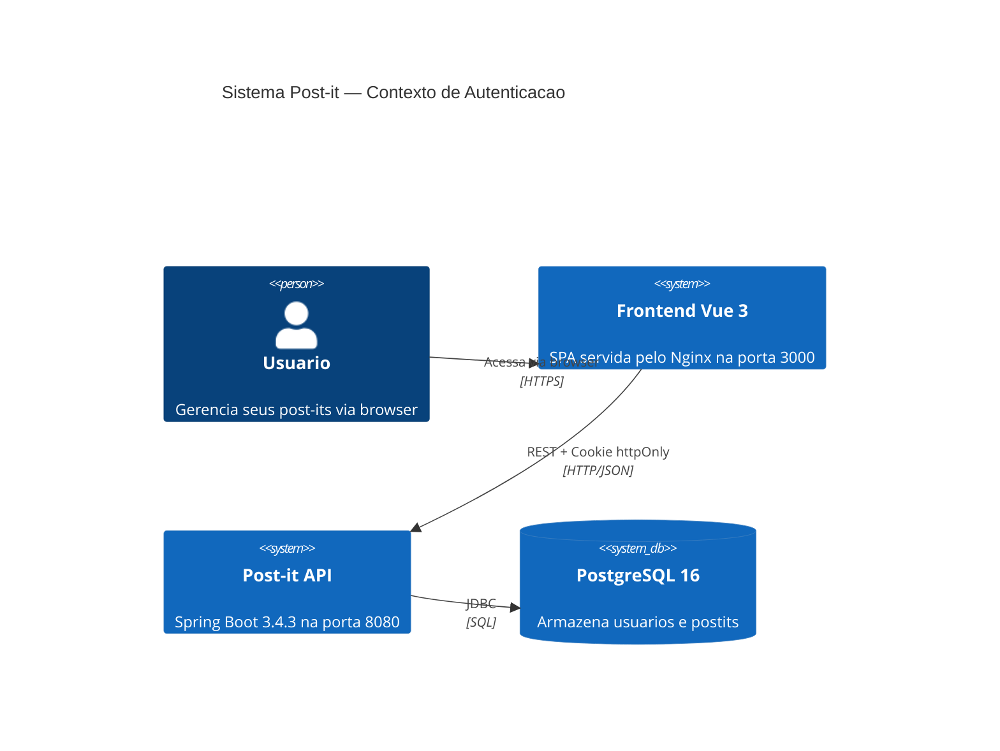
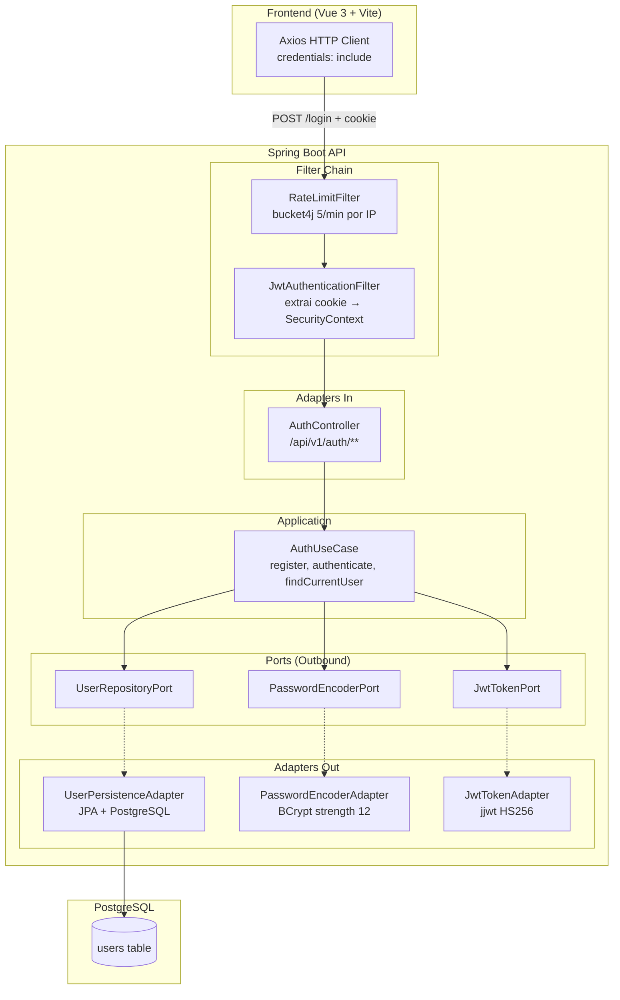
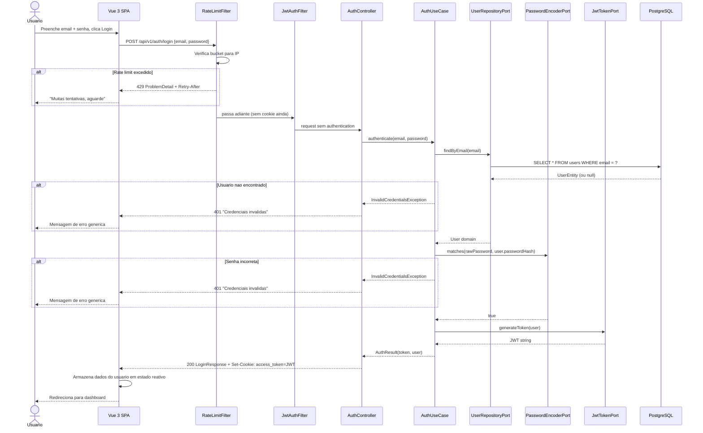
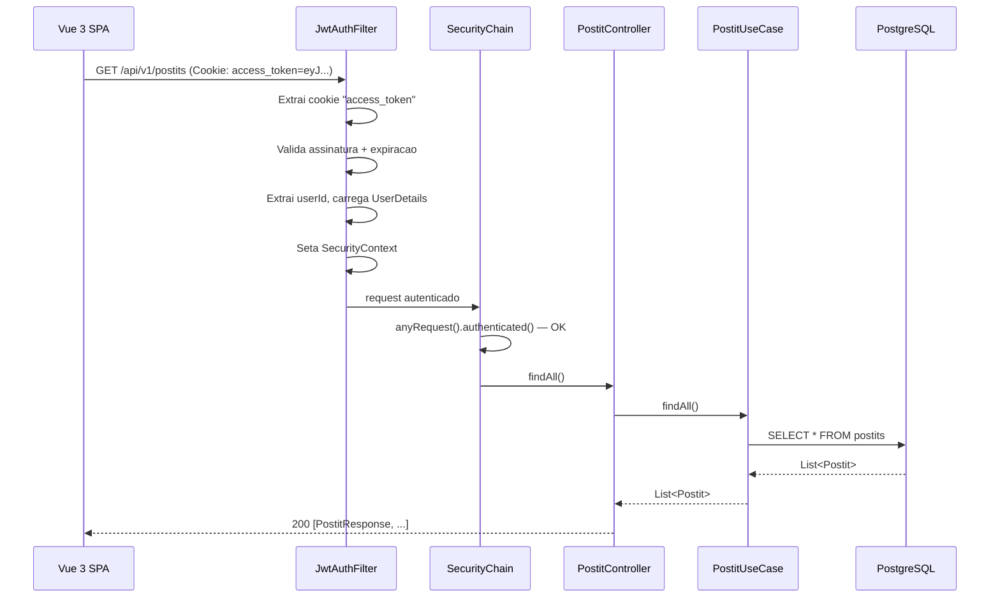

# Blueprint Tecnico: Autenticacao Local — prjeto-post-it

**Status:** Aprovado para implementacao
**Data:** 2026-03-28
**Autor:** architect

---

## Sumario

1. [Fluxo Completo por Operacao](#1-fluxo-completo-por-operacao)
2. [Contratos de Endpoints](#2-contratos-de-endpoints)
3. [Estrutura de Packages](#3-estrutura-de-packages)
4. [JWT Claims e Configuracao](#4-jwt-claims-e-configuracao)
5. [SecurityFilterChain](#5-securityfilterchain)
6. [Estrategia de Rate Limiting](#6-estrategia-de-rate-limiting)
7. [Migracao de Banco (Flyway)](#7-migracao-de-banco-flyway)
8. [Dependencias Maven](#8-dependencias-maven)
9. [Configuracao application.yml](#9-configuracao-applicationyml)
10. [Docker Compose — Variaveis](#10-docker-compose--variaveis)
11. [Diagramas](#11-diagramas)
12. [ADR](#12-adr)

---

## 1. Fluxo Completo por Operacao

### 1.1 Register (POST /api/v1/auth/register)

```
Frontend (Vue 3)
  │ POST /api/v1/auth/register { name, email, password }
  ▼
AuthController.register(RegisterRequest)
  │ Valida @Valid (name not blank, email format, password min 8 chars)
  ▼
AuthUseCase.register(name, email, rawPassword)
  │ 1. Verifica se email ja existe via UserRepositoryPort.findByEmail(email)
  │    → Se existe: lanca EmailAlreadyExistsException
  │ 2. Valida regras de dominio: User.create(name, email, rawPassword)
  │    → Domain record valida formato do email e tamanho minimo da senha
  │ 3. Gera hash: PasswordEncoderPort.encode(rawPassword) → BCrypt strength 12
  │ 4. Persiste: UserRepositoryPort.save(User com passwordHash)
  ▼
UserPersistenceAdapter.save(User)
  │ Converte User (domain) → UserEntity (JPA)
  │ Persiste via UserJpaRepository.save(entity)
  │ Converte UserEntity → User (domain) com ID gerado
  ▼
AuthController
  │ Converte User → RegisterResponse (id, name, email, createdAt)
  │ Retorna 201 Created + Location header
  ▼
Frontend recebe confirmacao (nao faz login automatico)
```

**Decisao:** O register NAO faz login automatico. O usuario deve fazer login explicitamente apos o registro. Isso simplifica o fluxo, facilita testes e permite adicionar verificacao de email no futuro sem breaking change.

### 1.2 Login (POST /api/v1/auth/login)

```
Frontend (Vue 3)
  │ POST /api/v1/auth/login { email, password }
  │ (credentials: 'include' no Axios para receber cookie)
  ▼
RateLimitFilter (bucket4j)
  │ Extrai IP do request (X-Forwarded-For ou remoteAddr)
  │ Consulta bucket para o IP: 5 tokens/min
  │ → Se esgotado: retorna 429 (ProblemDetail) + header Retry-After
  ▼
AuthController.login(LoginRequest)
  │ Valida @Valid (email format, password not blank)
  ▼
AuthUseCase.authenticate(email, rawPassword)
  │ 1. Busca usuario: UserRepositoryPort.findByEmail(email)
  │    → Se nao existe: lanca InvalidCredentialsException (mensagem generica)
  │ 2. Verifica senha: PasswordEncoderPort.matches(rawPassword, user.passwordHash())
  │    → Se nao confere: lanca InvalidCredentialsException (mesma mensagem)
  │ 3. Gera token: JwtTokenPort.generateToken(user)
  │    → Claims: sub=userId, name, email, iat, exp (1h)
  │ 4. Retorna AuthResult(token, user)
  ▼
AuthController
  │ Cria cookie httpOnly:
  │   Cookie("access_token", token)
  │   .httpOnly(true)
  │   .secure(false)          ← false para localhost; true em producao
  │   .path("/")
  │   .maxAge(3600)           ← 1 hora (alinhado com exp do JWT)
  │   .sameSite("Lax")
  │ Retorna 200 OK + Set-Cookie header + LoginResponse (id, name, email)
  ▼
Frontend armazena dados do usuario em memoria (Pinia/reactive state)
  Nao armazena token — ele vem automaticamente via cookie
```

**Por que erro 401 generico:** Retornar "email nao encontrado" vs "senha incorreta" permite enumeracao de usuarios. A mensagem sempre sera "Credenciais invalidas" independente do motivo.

### 1.3 Request Autenticado (qualquer endpoint protegido)

```
Frontend (Vue 3)
  │ GET /api/v1/postits (credentials: 'include')
  │ Cookie: access_token=eyJhbGciOi...
  ▼
JwtAuthenticationFilter (OncePerRequestFilter)
  │ 1. Extrai cookie "access_token" do request
  │    → Se ausente: nao seta authentication, segue chain
  │ 2. Valida token: JwtTokenPort.validateToken(token)
  │    → Se expirado/invalido: nao seta authentication, segue chain
  │ 3. Extrai userId do token: JwtTokenPort.extractUserId(token)
  │ 4. Carrega user: UserDetailsService.loadUserByUsername(userId)
  │ 5. Cria UsernamePasswordAuthenticationToken
  │ 6. Seta no SecurityContextHolder
  │ 7. Continua filter chain
  ▼
SecurityFilterChain avalia authorization
  │ → Se path publico (/api/v1/auth/**, /swagger-ui/**, etc.): permite
  │ → Se path protegido e sem authentication: retorna 401
  │ → Se autenticado: continua para o controller
  ▼
PostitController.findAll()
  │ (endpoint protegido funciona normalmente)
  ▼
Response 200 OK
```

**Decisao de design do filtro:** O filtro NUNCA lanca excecao. Se o token esta ausente ou invalido, ele simplesmente nao seta o SecurityContext. A responsabilidade de retornar 401 e do `AuthenticationEntryPoint` configurado no SecurityFilterChain.

### 1.4 Logout (POST /api/v1/auth/logout)

```
Frontend (Vue 3)
  │ POST /api/v1/auth/logout (credentials: 'include')
  ▼
AuthController.logout()
  │ Cria cookie de invalidacao:
  │   Cookie("access_token", "")
  │   .httpOnly(true)
  │   .secure(false)
  │   .path("/")
  │   .maxAge(0)              ← Remove o cookie imediatamente
  │   .sameSite("Lax")
  │ Retorna 204 No Content + Set-Cookie (expira cookie)
  ▼
Frontend limpa estado do usuario em memoria
```

**Por que nao invalidamos o JWT no servidor:** Para autenticacao local com tokens de 1h, a complexidade de manter uma blacklist (Redis ou tabela) nao se justifica. O cookie e removido do browser e o token expira em no maximo 1h. Se futuramente precisarmos de invalidacao imediata (ex: "deslogar de todos os dispositivos"), podemos adicionar um campo `tokenVersion` no User e incrementa-lo no logout — tokens com versao antiga serao rejeitados pelo filtro.

### 1.5 GET /api/v1/auth/me (Dados do usuario logado)

```
Frontend (Vue 3)
  │ GET /api/v1/auth/me (credentials: 'include')
  │ Cookie: access_token=eyJhbGciOi...
  ▼
JwtAuthenticationFilter
  │ (mesmo fluxo da secao 1.3 — valida token, seta SecurityContext)
  ▼
AuthController.me(Authentication)
  │ Extrai userId do Authentication (principal)
  │ Busca usuario: AuthUseCase.findCurrentUser(userId)
  │ → Se nao encontrado: 401 (usuario deletado apos emissao do token)
  ▼
Retorna 200 OK + UserResponse (id, name, email, createdAt)
```

---

## 2. Contratos de Endpoints

### 2.1 POST /api/v1/auth/register

**Descricao:** Registra um novo usuario no sistema.

**Request:**
```http
POST /api/v1/auth/register
Content-Type: application/json

{
  "name": "Marcus Queiroz",
  "email": "marcus@example.com",
  "password": "senhaSegura123"
}
```

**Validacoes (Bean Validation):**
| Campo | Regras |
|-------|--------|
| `name` | `@NotBlank`, `@Size(min=2, max=100)` |
| `email` | `@NotBlank`, `@Email`, `@Size(max=255)` |
| `password` | `@NotBlank`, `@Size(min=8, max=72)` |

**Nota sobre max 72 chars no password:** BCrypt trunca silenciosamente apos 72 bytes. Limitar no DTO evita comportamento surpresa.

**Responses:**

| Status | Quando | Body |
|--------|--------|------|
| `201 Created` | Registro bem-sucedido | `RegisterResponse` + `Location: /api/v1/auth/register/{id}` |
| `400 Bad Request` | Validacao falhou | ProblemDetail RFC 9457 |
| `409 Conflict` | Email ja registrado | ProblemDetail RFC 9457 |

**Response 201:**
```json
{
  "id": 1,
  "name": "Marcus Queiroz",
  "email": "marcus@example.com",
  "createdAt": "2026-03-28T14:30:00"
}
```

**Response 409:**
```json
{
  "type": "https://api.postits.local/errors/email-already-exists",
  "title": "Email ja registrado",
  "status": 409,
  "detail": "Ja existe uma conta associada a este email.",
  "instance": "/api/v1/auth/register"
}
```

### 2.2 POST /api/v1/auth/login

**Descricao:** Autentica o usuario e retorna cookie JWT.

**Request:**
```http
POST /api/v1/auth/login
Content-Type: application/json

{
  "email": "marcus@example.com",
  "password": "senhaSegura123"
}
```

**Validacoes:**
| Campo | Regras |
|-------|--------|
| `email` | `@NotBlank`, `@Email` |
| `password` | `@NotBlank` |

**Responses:**

| Status | Quando | Body | Headers |
|--------|--------|------|---------|
| `200 OK` | Login bem-sucedido | `LoginResponse` | `Set-Cookie: access_token=...` |
| `401 Unauthorized` | Credenciais invalidas | ProblemDetail RFC 9457 | — |
| `429 Too Many Requests` | Rate limit excedido | ProblemDetail RFC 9457 | `Retry-After: {seconds}` |

**Response 200:**
```json
{
  "id": 1,
  "name": "Marcus Queiroz",
  "email": "marcus@example.com"
}
```

**Header Set-Cookie:**
```
Set-Cookie: access_token=eyJhbGciOiJIUzI1NiJ9...; Path=/; Max-Age=3600; HttpOnly; SameSite=Lax
```

**Response 401 (mensagem generica — nao revela motivo):**
```json
{
  "type": "https://api.postits.local/errors/invalid-credentials",
  "title": "Credenciais invalidas",
  "status": 401,
  "detail": "Email ou senha incorretos.",
  "instance": "/api/v1/auth/login"
}
```

**Response 429:**
```json
{
  "type": "https://api.postits.local/errors/rate-limit-exceeded",
  "title": "Limite de requisicoes excedido",
  "status": 429,
  "detail": "Numero maximo de tentativas de login excedido. Tente novamente em 60 segundos.",
  "instance": "/api/v1/auth/login"
}
```

### 2.3 GET /api/v1/auth/me

**Descricao:** Retorna dados do usuario autenticado.

**Request:**
```http
GET /api/v1/auth/me
Cookie: access_token=eyJhbGciOiJIUzI1NiJ9...
```

**Responses:**

| Status | Quando | Body |
|--------|--------|------|
| `200 OK` | Usuario autenticado | `UserResponse` |
| `401 Unauthorized` | Token ausente, expirado ou invalido | ProblemDetail RFC 9457 |

**Response 200:**
```json
{
  "id": 1,
  "name": "Marcus Queiroz",
  "email": "marcus@example.com",
  "createdAt": "2026-03-28T14:30:00"
}
```

### 2.4 POST /api/v1/auth/logout

**Descricao:** Invalida o cookie de sessao.

**Request:**
```http
POST /api/v1/auth/logout
Cookie: access_token=eyJhbGciOiJIUzI1NiJ9...
```

**Responses:**

| Status | Quando | Body | Headers |
|--------|--------|------|---------|
| `204 No Content` | Logout bem-sucedido | (vazio) | `Set-Cookie: access_token=; Max-Age=0` |

**Nota:** O endpoint retorna 204 mesmo se o usuario nao estava logado (idempotente).

---

## 3. Estrutura de Packages

### 3.1 Novos Arquivos a Criar

```
backend/src/main/java/com/postit/
│
├── domain/
│   └── user/
│       └── User.java                          ← Domain record (sem JPA)
│
├── application/
│   ├── ports/
│   │   ├── UserRepositoryPort.java            ← Outbound port — persistencia de usuario
│   │   ├── PasswordEncoderPort.java           ← Outbound port — abstrai BCrypt
│   │   └── JwtTokenPort.java                  ← Outbound port — abstrai geracao/validacao JWT
│   └── usecases/
│       └── auth/
│           └── AuthUseCase.java               ← Implementa logica de register/login/me
│
├── infrastructure/
│   ├── adapters/
│   │   ├── in/
│   │   │   └── auth/
│   │   │       ├── AuthController.java        ← REST controller /api/v1/auth/**
│   │   │       ├── RegisterRequest.java       ← DTO de entrada (register)
│   │   │       ├── RegisterResponse.java      ← DTO de saida (register)
│   │   │       ├── LoginRequest.java          ← DTO de entrada (login)
│   │   │       ├── LoginResponse.java         ← DTO de saida (login)
│   │   │       └── UserResponse.java          ← DTO de saida (me)
│   │   └── out/
│   │       └── user/
│   │           ├── UserEntity.java            ← JPA entity (@Entity, @Table)
│   │           ├── UserJpaRepository.java     ← Spring Data JPA interface
│   │           └── UserPersistenceAdapter.java← Implementa UserRepositoryPort
│   └── config/
│       └── security/
│           ├── SecurityConfig.java            ← SecurityFilterChain, CORS, AuthEntryPoint
│           ├── JwtAuthenticationFilter.java   ← OncePerRequestFilter — extrai JWT do cookie
│           ├── JwtTokenAdapter.java           ← Implementa JwtTokenPort (jjwt library)
│           ├── PasswordEncoderAdapter.java    ← Implementa PasswordEncoderPort (BCrypt)
│           ├── CustomUserDetailsService.java  ← Implementa UserDetailsService do Spring
│           ├── RateLimitFilter.java           ← OncePerRequestFilter — bucket4j por IP
│           └── CookieUtil.java               ← Utility para criar/invalidar cookies httpOnly
│
├── shared/
│   └── exception/
│       ├── PostitNotFoundException.java       ← (ja existe)
│       ├── EmailAlreadyExistsException.java   ← NOVO — 409
│       └── InvalidCredentialsException.java   ← NOVO — 401
│
backend/src/main/resources/
│   └── db/migration/
│       └── V2__create_users_table.sql         ← NOVA migracao Flyway
│
backend/src/test/java/com/postit/
│   ├── application/usecases/auth/
│   │   └── AuthUseCaseTest.java               ← Testes unitarios (Mockito)
│   ├── infrastructure/adapters/out/user/
│   │   └── UserPersistenceAdapterIntegrationTest.java  ← Testcontainers
│   ├── infrastructure/adapters/in/auth/
│   │   └── AuthControllerTest.java            ← MockMvc ou WebMvcTest
│   ├── infrastructure/config/security/
│   │   ├── JwtTokenAdapterTest.java           ← Teste de geracao/validacao JWT
│   │   └── RateLimitFilterTest.java           ← Teste de rate limiting
│   └── test/
│       └── UserObjectMother.java              ← Factory de fixtures (Object Mother)
```

### 3.2 Arquivos Existentes a Modificar

| Arquivo | Alteracao |
|---------|-----------|
| `pom.xml` | Adicionar dependencias: spring-boot-starter-security, jjwt, bucket4j |
| `application.yml` | Adicionar secao `jwt:` e `rate-limit:` |
| `BeanConfig.java` | Adicionar beans de AuthUseCase e ports de seguranca |
| `GlobalExceptionHandler.java` | Adicionar handlers para `EmailAlreadyExistsException`, `InvalidCredentialsException` |
| `docker-compose.yml` | Adicionar env var `JWT_SECRET` no servico `api` |
| `OpenApiConfig.java` | Adicionar SecurityScheme (cookie auth) no Swagger |

### 3.3 Justificativa das Abstractions (Ports)

Por que `PasswordEncoderPort` e `JwtTokenPort` em vez de usar BCrypt e jjwt diretamente no UseCase?

- **Testabilidade:** O `AuthUseCase` e testado com mocks dos ports, sem precisar de BCrypt real (lento com strength 12) ou chave JWT.
- **Regra hexagonal:** O domain/application layer nao importa dependencias de infraestrutura. BCrypt e jjwt sao detalhes de implementacao.
- **Substituibilidade:** Se no futuro trocarmos jjwt por outra lib (nimbus-jose, spring-security-oauth2-jose), apenas o adapter muda.

---

## 4. JWT Claims e Configuracao

### 4.1 Estrutura do Token

```json
{
  "sub": "1",
  "name": "Marcus Queiroz",
  "email": "marcus@example.com",
  "iat": 1711633800,
  "exp": 1711637400
}
```

| Claim | Tipo | Descricao |
|-------|------|-----------|
| `sub` | String | ID do usuario (convertido de Long para String, conforme RFC 7519) |
| `name` | String | Nome completo do usuario |
| `email` | String | Email do usuario |
| `iat` | NumericDate | Timestamp de emissao (epoch seconds) |
| `exp` | NumericDate | Timestamp de expiracao: `iat + 3600` (1 hora) |

**Claims nao incluidas (e por que):**
- `roles`/`authorities`: Nao ha sistema de roles neste MVP. Quando houver, adicionar claim `roles: ["USER", "ADMIN"]`.
- `jti` (JWT ID): Necessario apenas se implementarmos blacklist de tokens. Reservado para futuro.
- `iss` (issuer): Util em ambientes multi-servico. Overkill para aplicacao local single-service.

### 4.2 Algoritmo e Chave

| Parametro | Valor | Justificativa |
|-----------|-------|---------------|
| Algoritmo | `HS256` (HMAC-SHA256) | Simetrico, performatico, adequado para single-service. RS256 so se justifica com multiplos consumidores do token. |
| Tamanho da chave | 256 bits (32 bytes) minimo | Requisito do HS256 por spec. |
| Env var | `JWT_SECRET` | Nunca hardcoded. |

### 4.3 Geracao do Secret

```bash
# Gerar secret seguro (48 chars hex = 192 bits, acima do minimo)
openssl rand -hex 32
```

### 4.4 Configuracao em application.yml

```yaml
jwt:
  secret: ${JWT_SECRET:deve-ser-configurado-via-env-var}
  expiration-ms: 3600000    # 1 hora em milissegundos
  cookie-name: access_token
```

**Nota:** O valor default `deve-ser-configurado-via-env-var` vai causar falha na validacao JWT se ninguem configurar a env var. Isso e intencional — fail fast em vez de funcionar com secret previsivel.

---

## 5. SecurityFilterChain

### 5.1 Configuracao Completa

```java
@Bean
public SecurityFilterChain securityFilterChain(HttpSecurity http) throws Exception {
    return http
        // 1. CSRF desabilitado — SPA stateless, JWT via cookie httpOnly
        .csrf(csrf -> csrf.disable())

        // 2. Sessao stateless — sem HttpSession
        .sessionManagement(session ->
            session.sessionCreationPolicy(SessionCreationPolicy.STATELESS))

        // 3. CORS — apenas localhost:3000
        .cors(cors -> cors.configurationSource(corsConfigurationSource()))

        // 4. Regras de autorizacao
        .authorizeHttpRequests(auth -> auth
            // Endpoints publicos (sem autenticacao)
            .requestMatchers(
                "/api/v1/auth/register",
                "/api/v1/auth/login",
                "/api/v1/auth/logout",
                "/actuator/health",
                "/swagger-ui/**",
                "/swagger-ui.html",
                "/v3/api-docs/**"
            ).permitAll()
            // Todo o resto exige autenticacao
            .anyRequest().authenticated()
        )

        // 5. Exception handling — 401 customizado (ProblemDetail)
        .exceptionHandling(ex -> ex
            .authenticationEntryPoint(problemDetailAuthEntryPoint()))

        // 6. Filtro JWT antes do UsernamePasswordAuthenticationFilter
        .addFilterBefore(jwtAuthenticationFilter,
            UsernamePasswordAuthenticationFilter.class)

        // 7. Filtro rate limit antes do JWT (para /login apenas)
        .addFilterBefore(rateLimitFilter,
            JwtAuthenticationFilter.class)

        .build();
}
```

### 5.2 Ordem dos Filtros

```
Request
  │
  ▼
RateLimitFilter          ← Aplica apenas em POST /api/v1/auth/login
  │                        429 se exceder 5 req/min por IP
  ▼
JwtAuthenticationFilter  ← Extrai cookie, valida JWT, seta SecurityContext
  │                        Nao lanca excecao — apenas nao autentica se invalido
  ▼
AuthorizationFilter      ← Spring Security avalia as regras de .authorizeHttpRequests()
  │                        401 via AuthenticationEntryPoint se nao autenticado
  ▼
Controller
```

### 5.3 CORS Configuration

```java
@Bean
public CorsConfigurationSource corsConfigurationSource() {
    CorsConfiguration config = new CorsConfiguration();
    config.setAllowedOrigins(List.of("http://localhost:3000"));
    config.setAllowedMethods(List.of("GET", "POST", "PUT", "DELETE", "OPTIONS"));
    config.setAllowedHeaders(List.of("Content-Type", "Accept"));
    config.setAllowCredentials(true);  // obrigatorio para cookies cross-origin
    config.setMaxAge(3600L);           // preflight cache 1h

    UrlBasedCorsConfigurationSource source = new UrlBasedCorsConfigurationSource();
    source.registerCorsConfiguration("/api/**", config);
    return source;
}
```

**Nota sobre `allowCredentials(true)`:** Obrigatorio para que o browser envie o cookie `access_token` nas requisicoes cross-origin (frontend em 3000, API em 8080). Sem isso, o cookie nao e enviado e toda requisicao autenticada falha.

### 5.4 AuthenticationEntryPoint (401 como ProblemDetail)

```java
// Retorna RFC 9457 ProblemDetail em vez do HTML default do Spring Security
@Bean
public AuthenticationEntryPoint problemDetailAuthEntryPoint() {
    return (request, response, authException) -> {
        response.setStatus(HttpServletResponse.SC_UNAUTHORIZED);
        response.setContentType(MediaType.APPLICATION_PROBLEM_JSON_VALUE);
        response.getWriter().write("""
            {
              "type": "https://api.postits.local/errors/unauthorized",
              "title": "Nao autenticado",
              "status": 401,
              "detail": "Autenticacao necessaria para acessar este recurso.",
              "instance": "%s"
            }
            """.formatted(request.getRequestURI()));
    };
}
```

### 5.5 JwtAuthenticationFilter — Pseudocodigo

```java
@Component
public class JwtAuthenticationFilter extends OncePerRequestFilter {

    @Override
    protected void doFilterInternal(HttpServletRequest request,
                                     HttpServletResponse response,
                                     FilterChain filterChain) {
        // 1. Extrair cookie "access_token"
        String token = CookieUtil.extractCookie(request, "access_token");

        // 2. Se ausente, segue sem autenticacao
        if (token == null) {
            filterChain.doFilter(request, response);
            return;
        }

        // 3. Validar token
        if (!jwtTokenPort.isTokenValid(token)) {
            filterChain.doFilter(request, response);
            return;
        }

        // 4. Extrair userId e carregar UserDetails
        String userId = jwtTokenPort.extractUserId(token);
        UserDetails userDetails = userDetailsService.loadUserByUsername(userId);

        // 5. Setar SecurityContext
        var authentication = new UsernamePasswordAuthenticationToken(
            userDetails, null, userDetails.getAuthorities());
        authentication.setDetails(
            new WebAuthenticationDetailsSource().buildDetails(request));
        SecurityContextHolder.getContext().setAuthentication(authentication);

        // 6. Continuar chain
        filterChain.doFilter(request, response);
    }

    @Override
    protected boolean shouldNotFilter(HttpServletRequest request) {
        // Nao filtrar paths publicos (otimizacao — evita parse de cookie desnecessario)
        String path = request.getRequestURI();
        return path.startsWith("/api/v1/auth/register")
            || path.startsWith("/api/v1/auth/login")
            || path.startsWith("/actuator")
            || path.startsWith("/swagger-ui")
            || path.startsWith("/v3/api-docs");
    }
}
```

---

## 6. Estrategia de Rate Limiting

### 6.1 Decisoes

| Aspecto | Decisao | Justificativa |
|---------|---------|---------------|
| Escopo | Apenas `POST /api/v1/auth/login` | Unico endpoint vulneravel a brute force |
| Chave | IP do cliente | Simples, efetivo para single-instance |
| Storage | In-memory (`ConcurrentHashMap`) | Single-instance, sem Redis. Limites resetam no restart — aceitavel para MVP. |
| Limite | 5 tentativas por minuto por IP | Equilibrio entre UX (erro de digitacao) e seguranca (brute force) |
| Resposta ao exceder | HTTP 429 + ProblemDetail + header `Retry-After` | RFC 9457 consistente com o resto da API |
| Cleanup | Eviction de buckets inativos a cada 10 minutos | Evita memory leak de IPs que nao retornam |

### 6.2 Implementacao com bucket4j

```java
// Configuracao do bucket (por IP)
private Bucket createNewBucket() {
    return Bucket.builder()
        .addLimit(
            BandwidthBuilder.builder()
                .capacity(5)                           // 5 tokens
                .refillGreedy(5, Duration.ofMinutes(1)) // refill total a cada 1 min
                .build()
        )
        .build();
}
```

### 6.3 RateLimitFilter — Pseudocodigo

```java
@Component
public class RateLimitFilter extends OncePerRequestFilter {

    private final Map<String, Bucket> buckets = new ConcurrentHashMap<>();

    @Override
    protected void doFilterInternal(HttpServletRequest request,
                                     HttpServletResponse response,
                                     FilterChain chain) {
        String ip = resolveClientIp(request);
        Bucket bucket = buckets.computeIfAbsent(ip, k -> createNewBucket());
        ConsumptionProbe probe = bucket.tryConsumeAndReturnRemaining(1);

        if (!probe.isConsumed()) {
            long waitSeconds = probe.getNanosToWaitForRefill() / 1_000_000_000;
            response.setStatus(429);
            response.setHeader("Retry-After", String.valueOf(waitSeconds));
            response.setContentType(MediaType.APPLICATION_PROBLEM_JSON_VALUE);
            response.getWriter().write(/* ProblemDetail JSON */);
            return; // nao continua chain
        }

        chain.doFilter(request, response);
    }

    @Override
    protected boolean shouldNotFilter(HttpServletRequest request) {
        // Aplica APENAS em POST /api/v1/auth/login
        return !(request.getMethod().equals("POST")
              && request.getRequestURI().equals("/api/v1/auth/login"));
    }

    private String resolveClientIp(HttpServletRequest request) {
        String xff = request.getHeader("X-Forwarded-For");
        if (xff != null && !xff.isBlank()) {
            return xff.split(",")[0].trim(); // primeiro IP da cadeia
        }
        return request.getRemoteAddr();
    }
}
```

### 6.4 Limpeza de Buckets Inativos

```java
@Scheduled(fixedRate = 600_000) // 10 minutos
public void evictStaleBuckets() {
    // Remove buckets com tokens cheios (nao foram consumidos recentemente)
    buckets.entrySet().removeIf(entry ->
        entry.getValue().getAvailableTokens() == 5);
}
```

### 6.5 Evolucao Futura

Se o sistema escalar para multiplas instancias, migrar de in-memory para:
- **bucket4j-redis** (Lettuce ou Jedis) — rate limit distribuido
- Chave Redis: `rate-limit:login:{ip}` com TTL de 60s

---

## 7. Migracao de Banco (Flyway)

### V2__create_users_table.sql

```sql
CREATE TABLE users (
    id            BIGSERIAL       PRIMARY KEY,
    name          VARCHAR(100)    NOT NULL,
    email         VARCHAR(255)    NOT NULL,
    password_hash VARCHAR(60)     NOT NULL,
    created_at    TIMESTAMP WITHOUT TIME ZONE DEFAULT CURRENT_TIMESTAMP,
    updated_at    TIMESTAMP WITHOUT TIME ZONE DEFAULT CURRENT_TIMESTAMP
);

-- Indice unico no email — garante unicidade no banco (defense in depth)
CREATE UNIQUE INDEX idx_users_email ON users(email);
```

**Notas:**
- `password_hash VARCHAR(60)`: BCrypt sempre produz hash de exatamente 60 caracteres.
- `UNIQUE INDEX` no email: Validacao de unicidade no banco alem do check no use case. Protege contra race condition (duas requisicoes simultaneas com mesmo email).
- Nao adiciona FK de `postits` para `users` nesta migracao. A associacao de postits a usuarios sera uma migracao futura (V3), para manter o escopo isolado.

---

## 8. Dependencias Maven

Adicionar ao `pom.xml`:

```xml
<!-- Spring Security -->
<dependency>
    <groupId>org.springframework.boot</groupId>
    <artifactId>spring-boot-starter-security</artifactId>
</dependency>

<!-- JWT (jjwt) -->
<dependency>
    <groupId>io.jsonwebtoken</groupId>
    <artifactId>jjwt-api</artifactId>
    <version>0.12.6</version>
</dependency>
<dependency>
    <groupId>io.jsonwebtoken</groupId>
    <artifactId>jjwt-impl</artifactId>
    <version>0.12.6</version>
    <scope>runtime</scope>
</dependency>
<dependency>
    <groupId>io.jsonwebtoken</groupId>
    <artifactId>jjwt-jackson</artifactId>
    <version>0.12.6</version>
    <scope>runtime</scope>
</dependency>

<!-- Rate Limiting (bucket4j) -->
<dependency>
    <groupId>com.bucket4j</groupId>
    <artifactId>bucket4j_jdk17-core</artifactId>
    <version>8.14.0</version>
</dependency>

<!-- Spring Security Test -->
<dependency>
    <groupId>org.springframework.security</groupId>
    <artifactId>spring-security-test</artifactId>
    <scope>test</scope>
</dependency>
```

---

## 9. Configuracao application.yml

Secoes a adicionar:

```yaml
# --- Autenticacao JWT ---
jwt:
  secret: ${JWT_SECRET:deve-ser-configurado-via-env-var}
  expiration-ms: 3600000
  cookie-name: access_token

# --- Rate Limiting ---
rate-limit:
  login:
    capacity: 5
    refill-minutes: 1

# --- CORS ---
cors:
  allowed-origins: ${CORS_ALLOWED_ORIGINS:http://localhost:3000}
```

---

## 10. Docker Compose — Variaveis

Adicionar ao servico `api` no `docker-compose.yml`:

```yaml
api:
  environment:
    # ... (existentes)
    JWT_SECRET: ${JWT_SECRET:-troque-este-valor-em-producao-openssl-rand-hex-32}
    CORS_ALLOWED_ORIGINS: http://localhost:3000
```

Adicionar ao `.env.example`:

```bash
# JWT — OBRIGATORIO: gere com `openssl rand -hex 32`
JWT_SECRET=

# CORS — lista de origens permitidas
CORS_ALLOWED_ORIGINS=http://localhost:3000
```

---

## 11. Diagramas

### 11.1 Context Diagram (C4 Level 1)



### 11.2 Container Diagram (C4 Level 2) — Componentes de Seguranca



### 11.3 Diagrama de Sequencia — Login



### 11.4 Diagrama de Sequencia — Request Autenticado



---

## 12. ADR

> O ADR completo esta em `docs/architecture/adr/ADR-001-autenticacao-local-jwt-cookie.md`

### Resumo

- **Decisao:** Autenticacao local com Spring Security + JWT em httpOnly cookie + BCrypt + bucket4j rate limiting
- **Alternativas rejeitadas:**
  - **Session-based (HttpSession + JSESSIONID):** Mais simples, mas acopla estado ao servidor. Incompativel com deploy stateless e escala horizontal sem sticky sessions.
  - **JWT em localStorage:** Vulneravel a XSS. Cookie httpOnly elimina esse vetor.
  - **JWT em Authorization header (Bearer):** Seguro, mas requer armazenamento no frontend (localStorage/sessionStorage = XSS) ou em memoria (perde-se no reload).
  - **OAuth2/OIDC com provider externo:** Overkill para aplicacao local sem requisito de SSO.
  - **Spring Security OAuth2 Resource Server:** Projetado para tokens emitidos por authorization server externo. Para auth local com cookie, a abordagem manual (filtro customizado) e mais simples e direta.
- **Consequencias aceitas:**
  - Token nao e revogavel server-side (mitigado por expiracao curta de 1h)
  - Rate limiting in-memory perde estado no restart (aceitavel para single-instance)
  - CSRF desabilitado — aceitavel porque SPA stateless + SameSite=Lax + cookie httpOnly
